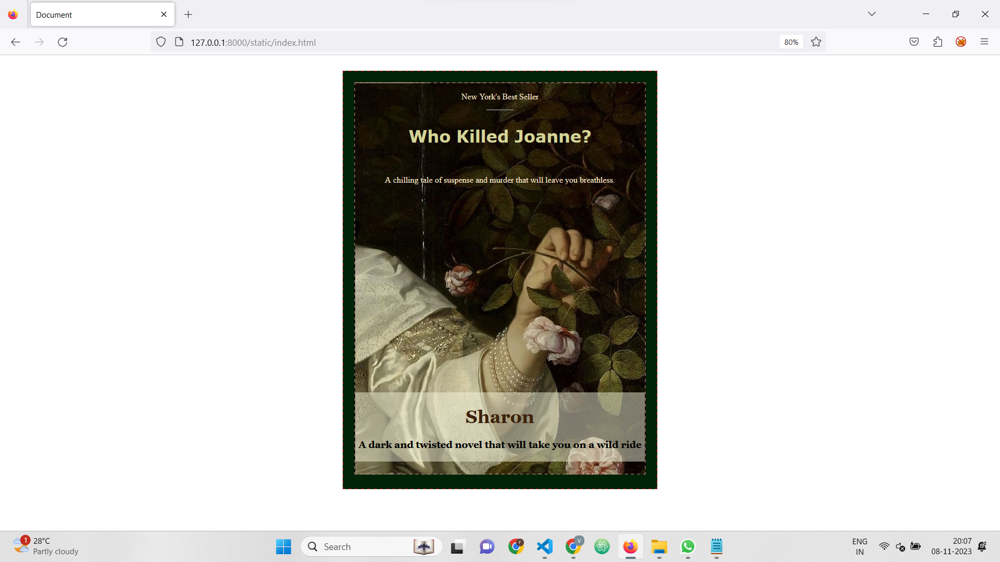

# Ex.06 Book Front Cover Page Design
## Date:
08-11-2023
## AIM:
To design a book front cover page using HTML and CSS.

## DESIGN STEPS:

### Step 1:
Clone the GitHub repository.

### Step 2:
Create a Django Admin interface.

### Step 3:
Write the HTML code with relevant CSS properties.

### Step 4:
Choose the appropriate style and color scheme.

### Step 5:
Validate the HTML code.

### Step 6:
Publish the website in the given URL.

## PROGRAM:
```
index.html

<html lang="en">
<head>
    <meta charset="UTF-8">
    <meta name="viewport" content="width=device-width, initial-scale=1.0">
    <link rel="stylesheet" href="style.css">
    <title>Document</title>
</head>
<body>
    <center>
        <div class="main">
            <div class="content">
                <p>New York's Best Seller</p>
                <hr width="50px">
                <div class="heading">
                    <h1>Who Killed Joanne?</h1>
                </div>
                <br>
                <p>A chilling tale of suspense and murder that will leave you breathless.</p>
                <div class="name">
                    <h1>Sharon</h1>
                    <h3>A dark and twisted novel that will take you on a wild ride</h3>
                </div>
            </div>

        </div>
    </center>

</body>
</html>

style.css

.main{

    border: 2px dashed rgba(174, 9, 9, 0.563);
    margin: 30px;
    height: 800px;
    width: 600px;
    background-color: rgb(0, 34, 6);
}
.content{
    margin: 20px;
    border: 2.5px dashed rgba(188, 143, 143, 0.573);
    height: 750px;
    background-image: url('main.jpg');
}

.content p{
    color: blanchedalmond;
}
.heading{
    margin-top: 30px;
    color: rgb(212, 212, 151);
    font-family: Verdana, Geneva, Tahoma, sans-serif;
}
.name{
    font-family: Georgia, 'Times New Roman', Times, serif;
    margin-top: 400px;
    background-color: rgba(245, 245, 220, 0.485);
    color: rgb(2, 2, 1);
    padding: 3px;
}
.name h1{
    color: rgb(60, 33, 9);
    font-size: 35px;
}
```

## OUTPUT:


## RESULT:
The program for designing book front cover page using HTML and CSS is completed successfully.
